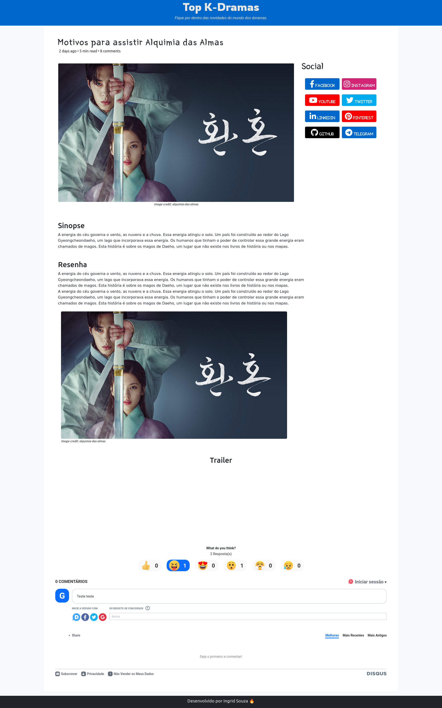

# Blog de Doramas

Este é um protótipo de um blog sobre doramas, com integração ao chat disqus. Contém imagem, descrição e a sinopse de alguns doramas.

- Na parte de conteudo é possível ler a sinopse, ler a resenha e assistir ao trailer.
- Também é possível reagir e comentar através do disqus.

## Table of contents

- [Screenshot](#screenshot)
- [Links](#links)
- [Author](#author)

## Screenshot

## Links

- Solution URL: [Solution here](https://ingridssilveira.github.io/blog/)

## Linguagem

<strong>Desenvolvido com:</strong>

<ul>
        <li>HTML;</li>
        <li>Bootstrap;</li>
        <li>SCSS(SASS): 
            <ul>
                <li>Variáveis e Mixins;</li>
            </ul>
        <li>Javascript: </li>
</ul>

## Author

- Website - [Ingrid Souza](https://ingridssilveira.github.io/IngridSouza)
- GitHub - [@IngridsSilveira](https://github.com/IngridsSilveira)
